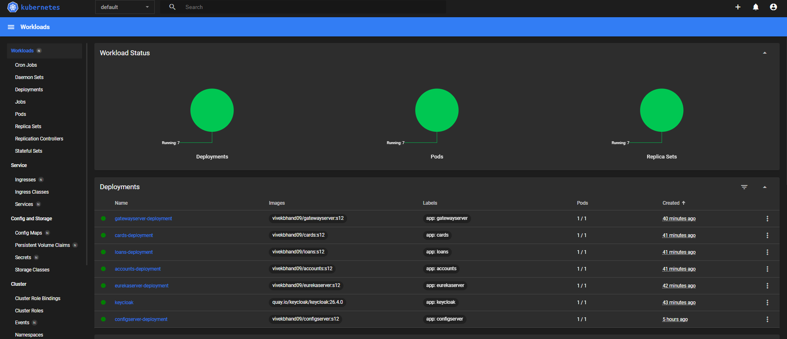

# EazyBank : Server-Side Service Discovery & Load Balancing with Kubernetes


## 🔹 Challenges with Client-Side Service Discovery using Eureka

1. **Complexity in Service Registration:** Each service must register itself with Eureka, increasing configuration overhead.  
2. **Client-Side Load Balancing Burden:** Services must implement their own load balancing logic (e.g., via Ribbon).  
3. **Service Registry Availability:** If Eureka server is down, clients may fail to discover services.  
4. **Dynamic Scaling Issues:** When services scale up/down, clients may not immediately know about new instances.  
5. **Increased Latency:** Each client request may need to query Eureka before service communication.  
6. **Tight Coupling:** Services depend on Eureka client libraries and network availability.

### ✅ Solution
- **Move service discovery responsibility to Kubernetes**.  
- Kubernetes provides a **server-side discovery & built-in load balancing**, removing the need for Eureka clients in each service.

---

## 🔹 Server-Side Service Discovery: 

**Definition:**  
Server-side service discovery means that **the responsibility of locating service instances and routing requests is handled by a central entity**, typically a **load balancer or Kubernetes Service**, rather than each client or microservice managing it themselves.  

- In Kubernetes, each microservice (pod) is **automatically registered** with a **Kubernetes Service** when deployed.  
- The Service acts as a **stable network endpoint** (ClusterIP or DNS name) for clients.  
- Kubernetes tracks **all healthy pod instances** and routes traffic accordingly.  

**Key Idea:**  
Clients do **not need to know pod IPs** or implement load balancing. The Kubernetes Service ensures **routing and load distribution** across pods automatically.

**Key Benefits:**  
- Simplified client configuration  
- Built-in load balancing  
- Fault-tolerant and scalable  
- Automatic handling of pod scaling and failures  

---

## 🔹 Example in EazyBank: Account Service → Loans Service

**Step-by-Step Process:**

1. **Client Request:**  
   A user calls the Account Service API (e.g., `/eazybank/accounts/{id}/loans`) to fetch loan information.  

2. **Feign Client in Account Service:**  
   - Uses the **Kubernetes Service endpoint** (`http://loans:8090`) instead of querying a service registry.  
   - The Feign client only knows the Service name, not individual pod IPs.  

3. **Kubernetes Service Routing:**  
   - The Service receives the request and automatically **routes it to a healthy Loans Service pod**.  
   - Kubernetes uses internal load balancing to distribute requests among all available pods.  

4. **Loans Service Processing:**  
   - The selected Loans Service pod processes the request and generates the response.  

5. **Response Back to Account Service:**  
   - Kubernetes Service sends the response back to the Account Service.  

6. **Account Service Aggregation:**  
   - Account Service may combine this data with other services (e.g., Cards) and return the aggregated response to the client.  

**Key Advantages in This Flow:**  
- No client-side service registry or load-balancing logic required  
- Requests automatically routed to healthy pods  
- Scaling pods up/down does not require client configuration changes  
- Improved fault tolerance and resiliency  

**Visualization:**  
```
Client → Account Service → Kubernetes Service (loans) → Loans Pod → Kubernetes Service → Account Service → Client
```


**Components involved:**

| Step | Component | Role |
|------|-----------|------|
| 1    | Account Microservice | Initiates request using Feign client |
| 2    | K8s Service (loans) | Server-side discovery & load balancing |
| 3    | Loans Microservice Pod | Processes request |
| 4    | K8s Service | Returns response via load balancer |
| 5    | Account Microservice | Sends response to client |

---

## 🔹 Differences: Client-Side vs Server-Side Discovery

| Aspect                  | Eureka (Client-Side)                 | Kubernetes (Server-Side)                  |
|--------------------------|-------------------------------------|------------------------------------------|
| Service Registry         | Client maintains registry            | Server/Service maintains registry        |
| Load Balancing           | Handled by client (Ribbon/Feign)    | Handled by Kubernetes Service            |
| Fault Tolerance          | Depends on Eureka availability      | Built-in, automatic via K8s              |
| Scaling                  | Clients need updates on scaling     | Automatic; new pods registered in Service|
| Client Complexity        | High (needs library & config)       | Low; just call service endpoint          |

---

## 🔹 Implementation Steps

### 1. Update Dependencies
Removed Eureka client dependency and added Kubernetes discovery client in all services:
```xml
<dependency>
    <groupId>org.springframework.cloud</groupId>
    <artifactId>spring-cloud-starter-kubernetes-discoveryclient</artifactId>
</dependency>
```

### 2. Enable Discovery in Main Application
```java
@EnableDiscoveryClient
@SpringBootApplication
public class AccountsApplication {
    public static void main(String[] args) {
        SpringApplication.run(AccountsApplication.class, args);
    }
}
```

### 3. Update `application.yaml` in All Services
Removed Eureka configs and added:
```yaml
spring:
  cloud:
    kubernetes:
      discovery:
        all-namespaces: true
```

### 4. Feign Client Updates in Account Service
```java
@FeignClient(name="cards", url = "http://cards:9000", fallback = CardsFallback.class)
public interface CardsFeignClient {
    @GetMapping(value = "/api/fetch", consumes = "application/json")
    ResponseEntity<CardsDto> fetchCardDetails(@RequestHeader("eazybank-correlation-id") String correlationId,
                                              @RequestParam String mobileNumber);
}

@FeignClient(name="loans", url = "http://loans:8090", fallback = LoansFallback.class)
public interface LoansFeignClient {
    @GetMapping(value = "/api/fetch", consumes = "application/json")
    ResponseEntity<LoansDto> fetchLoanDetails(@RequestHeader("eazybank-correlation-id") String correlationId,
                                              @RequestParam String mobileNumber);
}
```

### 5. Update Gateway Routes
```java
@Bean
public RouteLocator eazyBankRouteConfig(RouteLocatorBuilder routeLocatorBuilder) {
    return routeLocatorBuilder.routes()
        .route(p -> p.path("/eazybank/accounts/**")
                .filters(f -> f.rewritePath("/eazybank/accounts/(?<segment>.*)","/${segment}")
                               .addResponseHeader("X-Response-Time", LocalDateTime.now().toString())
                               .circuitBreaker(config -> config.setName("accountsCircuitBreaker")
                                                              .setFallbackUri("forward:/contactSupport")))
                .uri("http://accounts:8080"))
        .route(p -> p.path("/eazybank/loans/**")
                .filters(f -> f.rewritePath("/eazybank/loans/(?<segment>.*)","/${segment}")
                               .addResponseHeader("X-Response-Time", LocalDateTime.now().toString())
                               .retry(retryConfig -> retryConfig.setRetries(3)
                                                               .setMethods(HttpMethod.GET)
                                                               .setBackoff(Duration.ofMillis(100), Duration.ofMillis(1000),2,true)))
                .uri("http://loans:8090"))
        .route(p -> p.path("/eazybank/cards/**")
                .filters(f -> f.rewritePath("/eazybank/cards/(?<segment>.*)","/${segment}")
                               .addResponseHeader("X-Response-Time", LocalDateTime.now().toString())
                               .requestRateLimiter(config -> config.setRateLimiter(redisRateLimiter())
                                                                  .setKeyResolver(userKeyResolver())))
                .uri("http://cards:9000"))
        .build();
}
```

### 6. Deployment on Kubernetes
- All services are deployed on **local K8s cluster** using previous deployment manifests.  
- Kubernetes handles service registration, discovery, and load balancing automatically.  

### 7. Kubernetes Dashboard Screenshot
Deployed services visible on K8s dashboard:  


---

**With this approach:**  
- No client-side Eureka dependency  
- Server-side discovery and load balancing handled by Kubernetes  
- Simplified microservices architecture, better fault tolerance, and easier scaling
